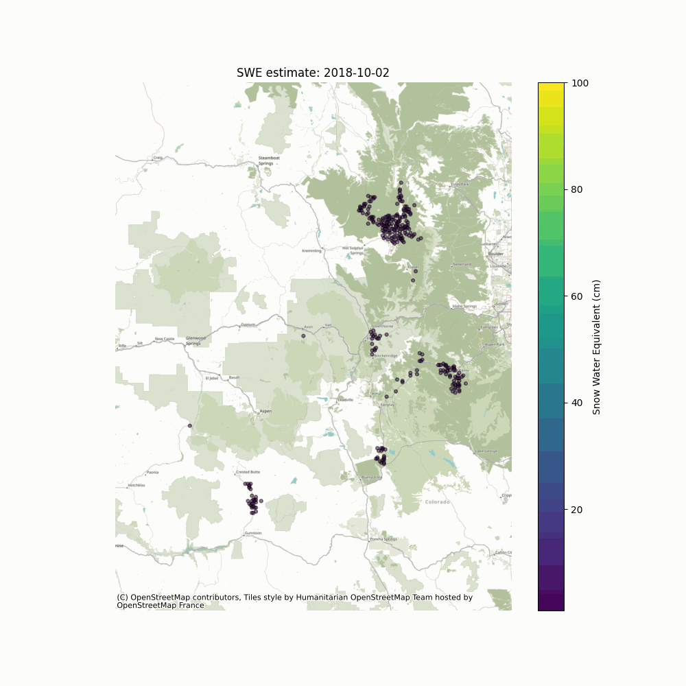

# Snow Water Equivalent Machine Learning (SWEMLv2.0): The evolution of the Snow Water Equivalent Machine Learning modeling workflow -  flexible spatial resolution, flexible model regions, and flexible grid/mesh 

## Deep Learning SWE prediction model
The current iteration of the SWEMLv2.0 produces SWE inferences for select locations throughout the Western U.S. plus the Upper Colorado River Basin.
There is a heavy focus on SWE inferences in the Sierra Nevada mountains, Colorado Rockies, and Wind River Range in Wyoming.
The ML pipeline retrieves all SWE observations from SNOTEL and CDEC snow monitoring locations for the date of interest and processes the SWE observations into a model-friendly data frame alongside lidar-derived terrain features, seasonality metrics, previous SWE estimates, and location.
SWEMLv2.0 predicts SWE using a multilayered perceptron network model for each supports an interactive visualization of the SWE estimates across the western U.S. 

Figure 1. Example hindcast simulation in the Colorado domain demonstrates snow accumulation as the season progresses, especially at higher elevations, and only predicts SWE where NASA VIIRS fSCA imagery indicates snow covering greater than 20% of the terrain.

## Data Sources (training, inference, where/how used)
Ground measurements for training  from the SNOTEL and CDEC features: ground_measure_features_templatev2.csv

Latitude, Longitude, and Elevation for all measurement locations: ground_measures_metadatav2.csv

GeoJSON data for the grid cell delineation: grid_cells.geoJSON file. 

SWE training measurements separate from ASO observations: train_labels.csv

The prediction grid cell IDs were identified by 
Latitude and longitude form the prediction cell ids and we descritize the western US into 23 regions based on Sturm's snow classification scheme and location
The ML workflow utilizes Previous SWE features for each prediction location and Delta SWE for each ground measurement site (e.g., SNOTEL/CDEC).
For each prediction location at the respective spatial resolution, the data processing scripts determine slope angle, aspect, and northness from a 30m Copernicus DEM. 

## Dependencies (versions, environments)
Python: Version 3.8 or 3.9.
Please refer to the  file to set up the appropriate virutal environment to run all functions.

### Required packages

| os           | ulmo       | pandas             |
|:-----------: | :--------: | :----------------: | 
| io           | shapely    | datetime           |
| re           | rasterio   | matplot.pyplot     |
| copy         | lightgbm   |  numpy             |
| time         | tensorflow |  pystac_client     |
| tables       | platfrom   | planetray_computer |
| xarray       | tqdm       | random             |
| rioxarray    | geopandas  | requests           |
| pyproj       | richdem    | cartopy            |
| h5py         | elevation  | cmocean            |
| mpl_toolkits | hdfdict    | warning            |
| math         | pickle     |  contextily        |
|folium        | branca     |  earthpy           | 
|netCDF4       | osgeo      | requests           |
| warnings     | geojson    | fiona              |
|fiona.crs     |webbrowser  |                    |
 
 ## Project support through [CIROH](https://ciroh.ua.edu/)
